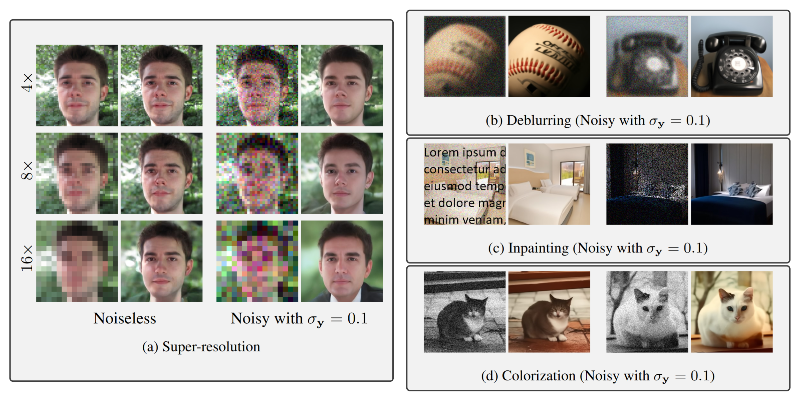

# Diffusion Models as Inverse Problem Solvers

<!-- [arXiv](https://arxiv.org/abs/2201.11793) | [PDF](https://ddrm-ml.github.io/DDRM-paper.pdf) | [Project Website](https://ddrm-ml.github.io/) -->

[Youngjin Hong](https://github.com/Hongyoungjin), [Ardavan Kaviany](kavia002@umn.edu), [Yuxiang Wan](wan01530@umn.edu)  <br />
 University of Minnesota

Repo for the course project in EE 5561 (Advisor: [Mehmet Akcakaya](https://cse.umn.edu/ece/mehmet-akcakaya)).

We compare performances of three different sampling methods as linear inverse problem solvers:
- [DDRM](https://ddrm-ml.github.io/): Denoising Diffusion Restoration Models
- [DDNM](https://github.com/wyhuai/DDNM): Zero-Shot Image Restoration Using Denoising Diffusion Null-Space Model
- [DiffPIR](https://github.com/yuanzhi-zhu/DiffPIR): Denoising Diffusion Models for Plug-and-Play Image Restoration

Each model is evaluated via following metrics:
- PSNR: Peak Signal-to-Noise Ratio
- SSIM: Structural Similarity Index
- [LPIPS](https://github.com/richzhang/PerceptualSimilarity): Learned Perceptual Image Patch Similarity

We observe the performance of each model in solving linear inverse problems:
- Image inpainting
- Super-resolution(x4, x8, x16)
- Gaussian blur removal

We use pre-trained [DDIMs](https://arxiv.org/abs/2010.02502) given by [DPS Repo](https://github.com/DPS2022/diffusion-posterior-sampling).

<!--  -->

## Running the Experiments
The code has been tested on PyTorch 1.8 and PyTorch 1.10. Please refer to `environment.yml` for a list of conda/mamba environments that can be used to run the code. 

### Pretrained models
We use pretrained models from [https://drive.google.com/drive/folders/1jElnRoFv7b31fG0v6pTSQkelbSX3xGZh?usp=sharing ](https://drive.google.com/drive/folders/1jElnRoFv7b31fG0v6pTSQkelbSX3xGZh?usp=sharing) given by [https://github.com/DPS2022/diffusion-posterior-sampling](https://github.com/DPS2022/diffusion-posterior-sampling).

### Test Dataset

We use 100 images from FFHQ, CelebA, and ImageNet validation set for comparison with other methods. The list of images is taken from [https://github.com/XingangPan/deep-generative-prior/](https://github.com/XingangPan/deep-generative-prior/)

The models and datasets are placed in the `exp/` folder as follows:
```bash
<exp> # a folder named by the argument `--exp` given to main.py
├── datasets # all dataset files
│   ├── celeba_hq/celeba_hq # all CelebA files
│   ├── ffhq/ffhq # all FFHQ files
│   └── ood/ood # out of distribution ImageNet images
├── logs # contains checkpoints
│   ├── celeba
│   │   └── celeba_hq.ckpt # the checkpoint file for CelebA-HQ
│   ├── ffhq
│   │   └── ffhq_10m.ckpt # the checkpoint file for FFHQ
│   ├── imagenet
│   │   └── imagenet256.ckpt # the checkpoint file for ImageNet256
iteration
└── image_samples # contains generated samples
```

### Sampling from the model

The general command to sample from the model is as follows:
```
python main.py --ni --config {CONFIG}.yml --doc {DATASET} --timesteps {STEPS} --eta {ETA} --etaB {ETA_B} --deg {DEGRADATION} --sigma_0 {SIGMA_0} --deblur_sigma {GAUSSIAN_DEBLUR_SIGMA} --inpaint_ratio {INPAINT_RATIO}-i {IMAGE_FOLDER}
```
where the following are options
- `ETA` is the eta hyperparameter in the paper. (default: `0.85`)
- `ETA_B` is the eta_b hyperparameter in the paper. (default: `1`)
- `STEPS` controls how many timesteps used in the process. (default: `20`)
- `DEGREDATION` is the type of degredation allowed. (One of: `inp`, `deblur_gauss`,`sr4`, `sr8`, `sr16`)
- `SIGMA_0` is the noise observed in y. (default: `0.05`)
- `GAUSSIAN_DEBLUR_SIGMA` is the standard deviation for the Gaussian Deblur kernel
-  `INPAINT_RATIO` is the ratio of the entire image that the model should inpaint (masked region)
- `CONFIG` is the name of the config file (see `configs/` for a list), including hyperparameters such as batch size and network architectures.
- `DATASET` is the name of the dataset used, to determine where the checkpoint file is found.
- `IMAGE_FOLDER` is the name of the folder the resulting images will be placed in (default: `images`)
<!-- 
For example, for sampling noisy 4x super resolution from the ImageNet 256x256 unconditional model using 20 steps:
```
python main.py --ni --config imagenet_256.yml --doc imagenet --timesteps 20 --eta 0.85 --etaB 1 --deg sr4 --sigma_0 0.05
``` -->
The generated images and the summary of each rollout are placed in the `<exp>/image_samples/{IMAGE_FOLDER}` folder, where `orig_{id}.png`, `y0_{id}.png`, `{id}_-1.png`, `result_summary.txt` refer to the original, degraded, restored images, and summary of the result respectively.

The config files contain a setting controlling whether to test on samples from the trained dataset's distribution or not.

### Images for Demonstration Purposes
A list of images for demonstration purposes can be found here: [https://github.com/jiamings/ddrm-exp-datasets](https://github.com/jiamings/ddrm-exp-datasets). Place them under the `<exp>/datasets` folder, and these commands can be excecuted directly:

FFHQ noisy 4x super-resolution:
```
python main.py --ni --config dps_ffhq.yml --doc ffhq --deg sr4 -i ffhq_sr4
```

FFHQ Gaussian deblurring with 1 Gaussian deblur sigma:
```
python main.py --ni --config dps_ffhq.yml --doc ffhq --deg deblur_gauss --deblur_sigma 1 -i ffhq_deblur_sigma_1
```

FFHQ inpainting with 90% inpainting ratio:
```
python main.py --ni --config dps_ffhq.yml --doc ffhq --deg inp --inpaint_ratio 0.9 -i ffhq_inp_ratio_0.9
```

## References and Acknowledgements
```
# DDRM
@inproceedings{kawar2022denoising,
    title={Denoising Diffusion Restoration Models},
    author={Bahjat Kawar and Michael Elad and Stefano Ermon and Jiaming Song},
    booktitle={Advances in Neural Information Processing Systems},
    year={2022}
}

# DDNM
@article{wang2022zero,
  title={Zero-Shot Image Restoration Using Denoising Diffusion Null-Space Model},
  author={Wang, Yinhuai and Yu, Jiwen and Zhang, Jian},
  journal={The Eleventh International Conference on Learning Representations},
  year={2023}
}

# DIffPIR
@inproceedings{zhu2023denoising, % DiffPIR
      title={Denoising Diffusion Models for Plug-and-Play Image Restoration},
      author={Yuanzhi Zhu and Kai Zhang and Jingyun Liang and Jiezhang Cao and Bihan Wen and Radu Timofte and Luc Van Gool},
      booktitle={IEEE Conference on Computer Vision and Pattern Recognition Workshops (NTIRE)},
      year={2023},
}
```

This implementation is based on / inspired by:
- [https://github.com/bahjat-kawar/ddrm](https://github.com/bahjat-kawar/ddrm) (The DDRM repo),
- [https://github.com/wyhuai/DDNM](https://github.com/wyhuai/DDNM) (The DDNM repo), 
- [https://github.com/yuanzhi-zhu/DiffPIR](https://github.com/yuanzhi-zhu/DiffPIR) (The DiffPIR repo), and
- [https://github.com/DPS2022/diffusion-posterior-sampling](https://github.com/DPS2022/diffusion-posterior-sampling) (The pre-trained DDIM ckpts based in FFHQ and ImageNet datasets)

